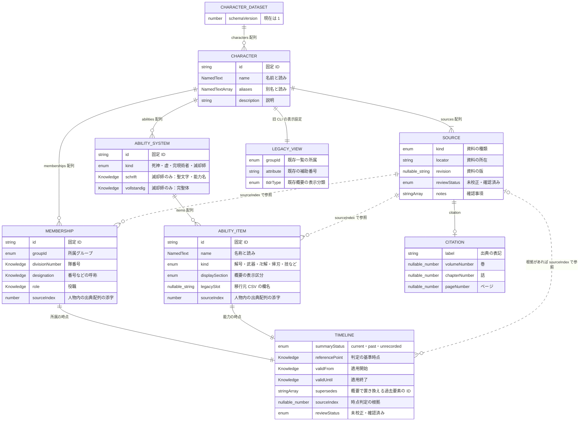
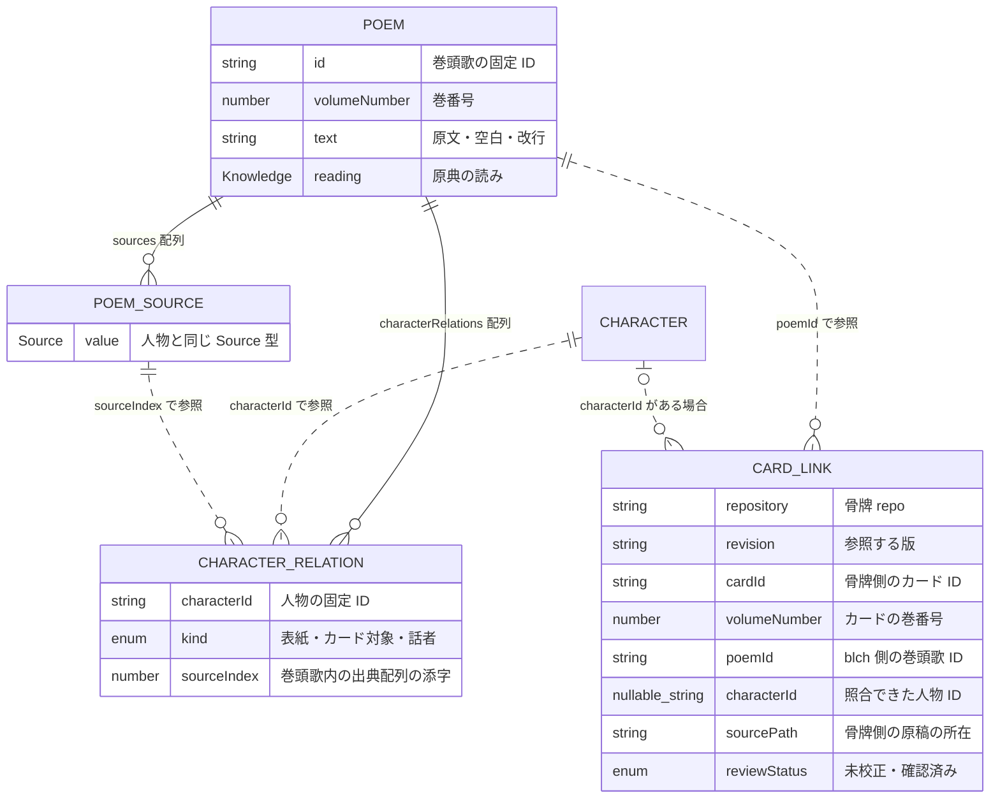

# データ構造の ER 図

[共有型](../types/characters.ts)と[データ管理](data.md)に対応する図です。実体は JSON の入れ子で、下の箱ごとに別ファイルやテーブルがあるわけではありません。実線は内包、点線は参照です。

## 人物データ（実装済み）

一人が複数の所属・能力体系を持ち、各体系に複数の能力名を持てます。例えば恋次の卍解2件は、一つの死神体系の中の別々の `AbilityItem` です。体系の区別と名前の区別を分けています。

`Source` 自体には ID がありません。`sourceIndex: 0` は、その人物の `sources[0]` を参照します。別の人物の出典へは参照しません。`Timeline` も各所属・能力の中に個別に保存するもので、所属と能力が同じ時点オブジェクトを共有するわけではありません。`supersedes` は同じ人物内の過去の所属・能力の ID を参照します。

今回の73人は CSV の情報だけで移行したため、所属・能力体系は人物あたり一つ、時点は全件未入力です。複数所属や最新優先の判定を、新しい事実として追加したわけではありません。旧一覧と echo の選択は `legacyView` / `legacySlot` で保持しています。

## 名前・未入力の表現

| 型 | 内容 |
| --- | --- |
| `NamedText` | `text`（表記）と `reading`（読みの Knowledge） |
| `Knowledge<T>` | `known` なら `value` を持つ。`unrecorded`（未入力）、`unknown`（不明）、`none`（なし）は値を持たない |
| `StoryPoint` | 時点の `label`、原作／アニメ／未入力を表す `continuity`、分かれば `chapterNumber` |

`referencePoint` / `validFrom` / `validUntil` はそれぞれ独立した `Knowledge<StoryPoint>` です。CSV の空欄を「不明」や「なし」に推測で変換しません。

## 巻頭歌・骨牌との連携（型・試作のみ）

こちらは人物の本番 JSON にはまだ含めていません。巻頭歌の正式取り込みは、別途提供いただく情報を使います。

`POEM_SOURCE` は図の中で人物側の出典と区別した名前で、実際には同じ `Source` 型です。人物との関係は配列で、話者などを推測で登録しません。

巻頭歌 ID と骨牌 ID は別です。初期の対応例は `poem-003` と `vol_03` を巻番号3で照合し、`CardLink` に明示します。骨牌の印字・項目 ID・TTS 調整・音声・再生設定は骨牌 repo に置きます。カードの巻番号と、カードにある名言の出所巻番号も別の情報です。

## P3 の形式拡張

本番は版2です。版1の読み込みも維持します。滅却師の `schrift` が既知でも、その `value.name` は `null`（能力名未入力）を許容します。文字の確認と名称の確認を分け、未確認の名称を推測しません。出典種別に `communityWebsite` を追加し、非公式サイトを公式サイトと区別しました。新規人物の一覧分類は `sternritter` を使います。複数サイト照合の範囲・確認日・保留事項は人物内の出典に保存し、原作直接確認とは区別します。
